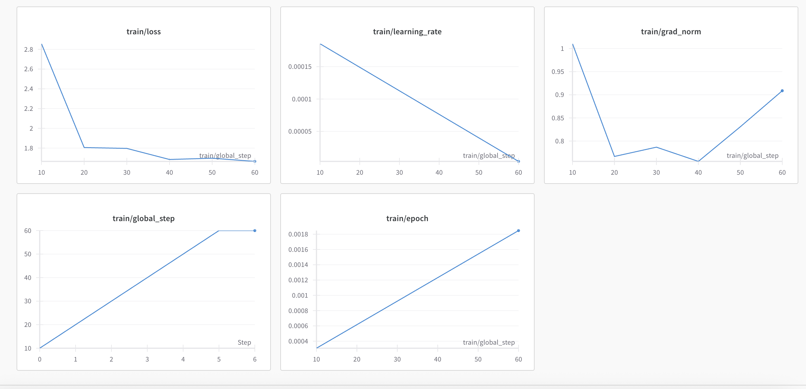
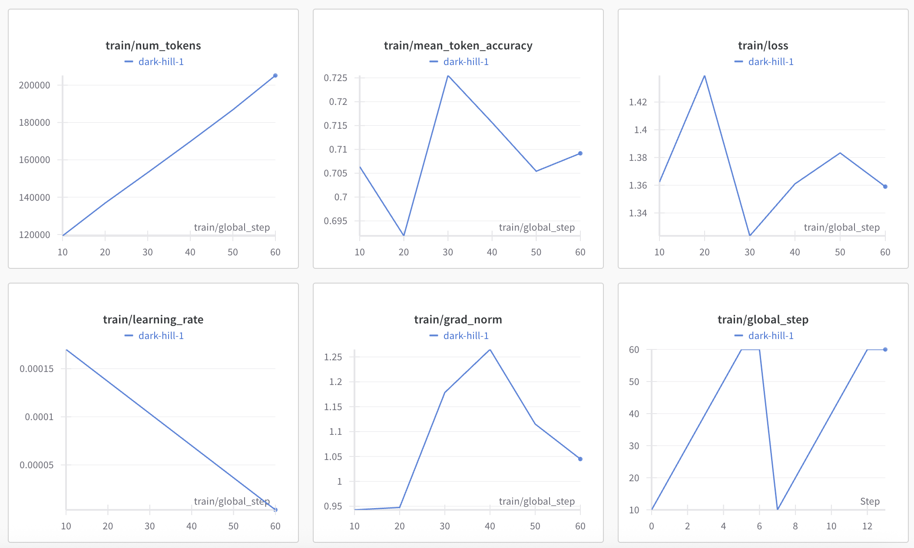

# 🩺 e_Doctor Chatbot

---

## 🚀 Project Overview

The **e_Doctor Chatbot** is an AI-powered conversational assistant designed to provide preliminary medical guidance and triage support for common health inquiries. It leverages state-of-the-art large language models fine-tuned specifically for medical dialogue to deliver accurate, contextually appropriate, and professionally worded advice.

This project uses the **DeepSeek-R1-Distill-Llama-8B** base model, fine-tuned with two advanced parameter-efficient methods:

- **LoRA (Low-Rank Adaptation)**
- **QLoRA (Quantized LoRA)**

Both methods enable fast and resource-efficient fine-tuning suitable for deployment in healthcare settings.

---

## 🛠️ Technologies & Frameworks

- [Unsloth](https://github.com/unslothai/unsloth) for fast and memory-efficient training
- [Hugging Face Transformers](https://huggingface.co/docs/transformers/index) for model and tokenizer management
- LoRA and QLoRA for parameter-efficient fine-tuning
- Python 3.8+

---

## 📂 Dataset

The chatbot is trained on medical dialogue data sourced from Kaggle:

- Dataset: [HealthcareMagic Dialogue](https://www.kaggle.com/datasets/hrezaeiyork/meddialogue/data?select=healthcaremagic_dialogue_1.txt)
- Format: JSON with patient queries and doctor responses
- QLoRA fine-tuning was performed on a subset of this dataset for efficiency.

---

## ⚙️ Fine-Tuning Details

| Method | Base Model | Dataset | Description |
|--------|------------|---------|-------------|
| LoRA   | deepseek-ai/DeepSeek-R1-Distill-Llama-8B | Full dataset | Parameter-efficient fine-tuning updating low-rank adapters |
| QLoRA  | deepseek-ai/DeepSeek-R1-Distill-Llama-8B | Subset of dataset | LoRA applied on 4-bit quantized model for memory efficiency |

---

## 📈 Training Curves

### LoRA Training

### QLoRA Training

---

## 📊 Evaluation Results

### LoRA Fine-Tuning

| Metric          | Value   | Description                                                    |
|-----------------|---------|----------------------------------------------------------------|
| ROUGE-1         | 0.1811  | Unigram overlap (measures recall of important words)           |
| ROUGE-2         | 0.0212  | Bigram overlap (measures recall of important word pairs)       |
| PPL             | 36.1155 | Reflects model fluency and prediction quality                  |
| Latency (ms)    | 5157.7  | Inference time per token                                       |
| Model Size (MB) | 176.53  | Disk size of the fine-tuned model (smaller is more deployable) |

### QLoRA Fine-Tuning

| Metric          | Value    | Description                                                    |
|-----------------|----------|----------------------------------------------------------------|
| ROUGE-1         | 0.201933 | Unigram overlap (measures recall of important words)           |
| ROUGE-2         | 0.04892  | Bigram overlap (measures recall of important word pairs)       |
| PPL             | 22.8     | Reflects model fluency and prediction quality                  |
| Latency (s)     | 15.726   | Inference time per token                                       |
| Model Size (MB) | 176.53   | Disk size of the fine-tuned model (smaller is more deployable) |

---

## 💡 Insights

- **QLoRA** fine-tuning achieves better ROUGE scores and lower perplexity, indicating improved fluency and accuracy.
- **LoRA** has higher latency but similar model size.
- Both methods provide efficient fine-tuning compared to full model training.

---

